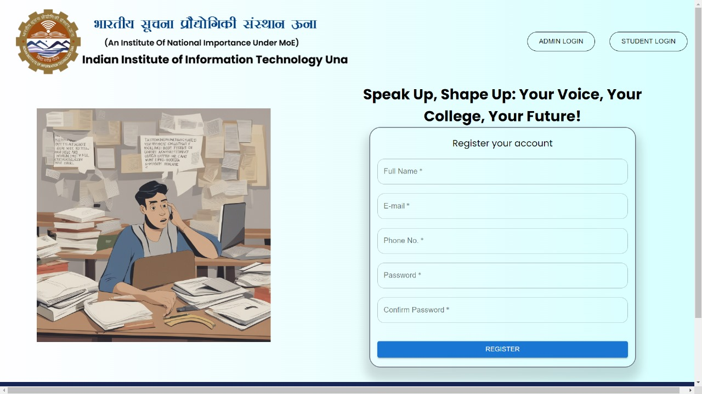
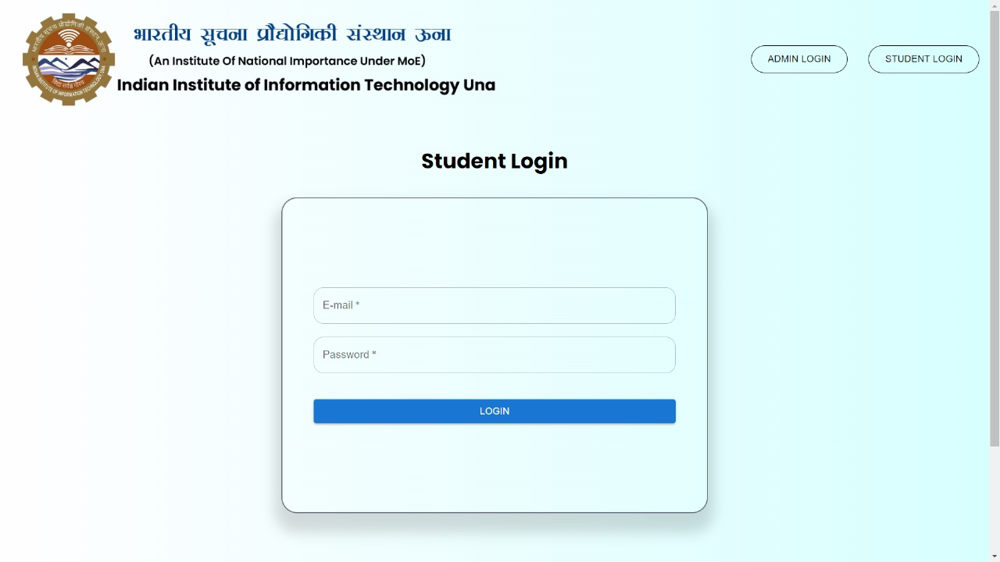

# MobilEASE


> A Web-Based Traffic Complaint System used for paperless quick response system with fast approval of leave and fast action on the complaint done by student.
## Background / Problem Statement

In our college, there is currently no efficient and organized system for students and staff to register, track, and resolve complaints regarding various campus-related issues. This lack of a streamlined process leads to several challenges, including delays in issue resolution, inefficient allocation of resources, and difficulty in accountability.

## Features

- Two types of users - citizen and official
- Progressive Web App (PWA)
- Completely Mobile Responsive
- Only citizen users can be created using the webpage, official credentials are given by admin
- Ability to attach video/image of the incident while reporting
- Ability to track reported complaints

## Screenshots

|  Home Page   |  **Login Page**    |
| ------------------------------------------------------------------- | -------------------------------------------------------------- |
|  **Report Complaint Page**  | 
 **Official Dashboard** |

## Languages, Frameworks, Tools used

- Figma for designing
- Vite + ReactJS
- Firebase as database (Firestore) and cloud storage
- Tailwind CSS for styling
- Material UI (MUI) for some components (Dialog, DataGrid, etc.)

## Developing

- Clone the repository
```shell
$ git clone https://github.com/vivekkj123/mobileEASE.git
```
- Install all dependencies

```shell
$ cd mobileEASE
$ npm i
```
- Create a firebase project and create a .env file at your local directory containing configuration of that project.
(Refer env.example for the variable names)

- Run the server
    ```shell
    $ npm run dev
    ```

    The application will be running at `http://localhost:5173`

## Contributing

This is the group project done for the prog-o-thon held in our institude IIIT una.

